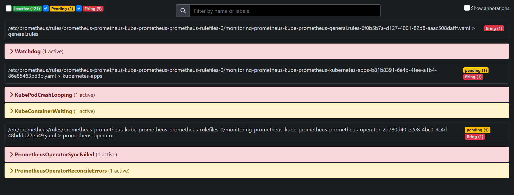
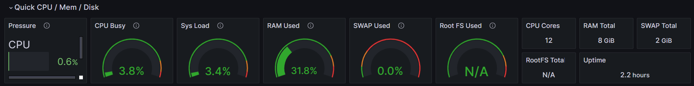
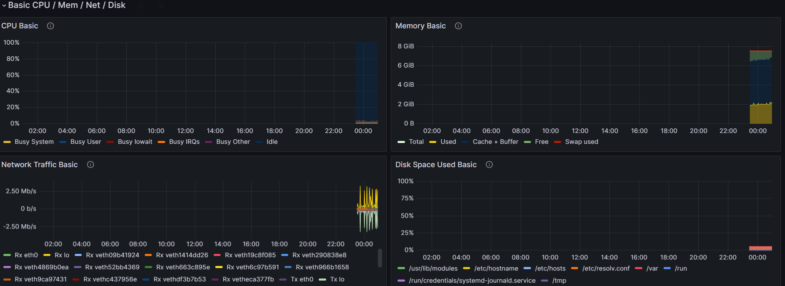
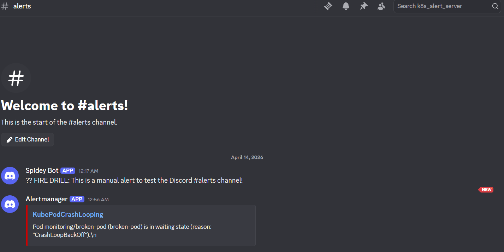
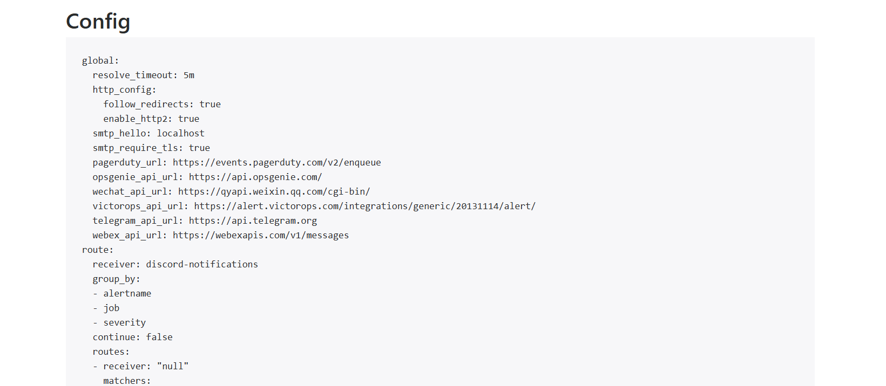

# 🚀 Cloud-Native Observability Lab: Kind, Terraform & Prometheus

An Infrastructure-as-Code (IaC) project to deploy a fully functional monitoring stack on a local Kind cluster. This lab focuses on a **Senior DevOps** approach: solving complex integration hurdles, configuring Discord alerting pipelines, and optimizing local resource usage.

---

## 🏗️ Architecture Overview
The stack uses the **Prometheus Operator** pattern to manage observability via Kubernetes Custom Resources (CRDs).


*Above: Prometheus successfully scraping cluster metrics.*

* **Cluster:** Kind (Kubernetes-in-Docker)
* **Provisioning:** Terraform (Helm Provider)
* **Metrics Collection:** Prometheus & Exporters (Node Exporter, Kube-State-Metrics)
* **Visualization:** Grafana (Pre-configured Dashboards)
* **Alerting:** AlertManager + Discord Webhook Integration

---

## 🛠️ Prerequisites
Before you start, ensure you have the following installed:

* [Docker Desktop](https://www.docker.com/products/docker-desktop/)
* [Kind](https://kind.sigs.k8s.io/docs/user/quick-start/)
* [Terraform](https://www.terraform.io/downloads)
* [Kubectl](https://kubernetes.io/docs/tasks/tools/)

---

## 🚀 Quick Start

### 1. Spin up the Cluster
```powershell
kind create cluster --name monitoring-lab
```

### 2. Initialize & Deploy
```powershell
terraform init
terraform apply -auto-approve
```

### 3. Access the Dashboards
| Service | Port-Forward Command | Credentials |
| :--- | :--- | :--- |
| **Grafana** | `3000:80` | `admin` / `admin123` |
| **Prometheus** | `9090:9090` | N/A |
| **AlertManager** | `9093:9093` | N/A |

### 📊 Visualization Showcase


*Proving observability: Resource utilization and cluster health visualized via Node Exporter Full dashboards.*

---

## 🔔 Discord Alerting Setup
To bridge AlertManager with Discord, we use the Slack-compatibility layer:

1. Create a **Discord Webhook** in your `#alerts` channel.
2. Append `/slack` to the end of your Webhook URL.
3. Update `values.yaml` with your URL.


*Outcome: Real-time cluster alerts routed directly to a Discord DevOps channel.*

---

## 🛠️ Major Challenges & Senior Solutions

### 1. The "Loopback Trap" (Control Plane Down)
* **Issue:** Control plane components showing as `DOWN` in Kind clusters.
* **Solution:** Disabled scraping for these components in `values.yaml` to mirror a managed EKS environment.

### 2. The "Invisible Handshake" (Empty Dashboards)
* **Issue:** CPU/Memory metrics remained blank due to label naming conventions.
* **Solution:** Migrated to **Dashboard ID 1860** for native compatibility with modern Prometheus Operator labels.

### 3. The "Null Receiver" Ghost
* **Issue:** AlertManager logs showed undefined receiver `null` blocking notifications.
* **Solution:** Explicitly defined a dummy receiver named `null`. This satisfied the Operator's validation logic, allowing the `discord-notifications` route to initialize.


*Validation: The AlertManager UI confirms the custom Discord route and receiver are active.*

---

## 🧹 Cleanup
To free up **~2.2 GB** of disk space:

```powershell
terraform destroy
kind delete cluster --name monitoring-lab
docker system prune -a --volumes
```

---

## 📈 Future Roadmap
- [ ] Add **Loki** for log aggregation.
- [ ] Implement **Ingress-Nginx** metrics.
- [ ] Deploy a **Python/Flask microservice** with a custom `ServiceMonitor`.